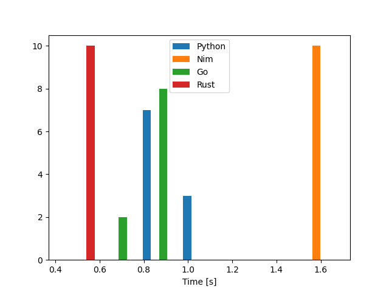
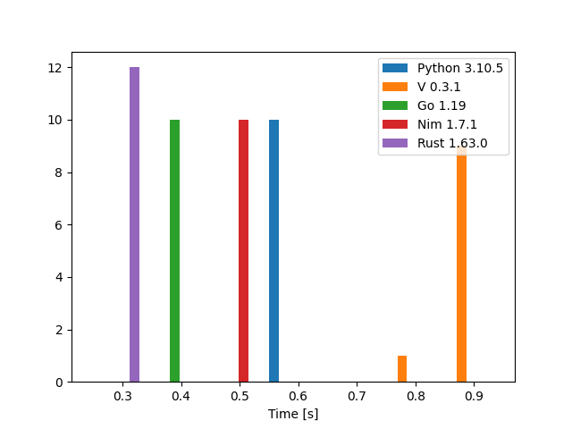

# Anagram

This is a Kata that I came across a few months ago. Though it is not truly a real world problem, it definitely embodies some of my daily challenges.

It operates on `338782` lines of text.

_I have tried to make all the versions as close as possible._

Here is the link to the [original Kata](http://codekata.com/kata/kata06-anagrams/).

**UPDATE 1**: The [initial test bench](#initial-test-bench) used `WSL2` and `Nim` performed very poorly. I then moved to a [baremetal](#new-test-bench) running Ubuntu 20.0.4 LTS and `Nim` ran **66%** faster. So, it means, `Nim` is having a hard time in virtualized environments. Sadly, as of this writing, `WSL2` does not fully support `perf` and a `flamegraph` could not be generated.

## Table of Contents

- [Anagram](#anagram)
  - [Table of Contents](#table-of-contents)
  - [Initial Test bench](#initial-test-bench)
  - [New Test bench](#new-test-bench)
  - [Languages](#languages)
  - [Prerequisites](#prerequisites)
    - [Python](#python)
    - [Nim](#nim)
    - [Go](#go)
    - [Rust](#rust)
    - [V](#v)
  - [Run](#run)
  - [Results](#results)
    - [Machine time (WSL2)](#machine-time-wsl2)
    - [Machine time (baremetal)](#machine-time-baremetal)
    - [Development time](#development-time)
    - [Verdict](#verdict)
    - [Closing Note](#closing-note)

## Initial Test bench

| OS                        | Kernel     | CPU                            | Memory |
| ------------------------- | ---------- | ------------------------------ | ------ |
| Ubuntu 20.04.4 LTS (WSL2) | 5.10.102.1 | Intel i7-7700HQ (8) @ 2.807GHz | 24GB   |

## New Test bench

| OS                             | Kernel            | CPU                            | Memory |
| ------------------------------ | ----------------- | ------------------------------ | ------ |
| Ubuntu 20.04.4 LTS (baremetal) | 5.15.0-46-generic | Intel i7-7700HQ (8) @ 3.800GHz | 24GB   |

## Languages

| Language | Version  |
| -------- | -------- |
| Python   | `3.10.5` |
| Nim      | `1.7.1`  |
| Go       | `1.19`   |
| Rust     | `1.63.0` |
| V        | `0.3.1`  |

`V` is only measured in the [new benchmark](#new-test-bench).

## Prerequisites

- Make sure your language versions match the [test bench](#languages)
- Benchmarking tool: [Hyperfine](https://github.com/sharkdp/hyperfine)
- Plotting done by [this script](https://github.com/sharkdp/hyperfine/blob/master/scripts/plot_histogram.py)
- Please `unrar` the `wordlist.rar` before running the benchmark.

  ```bash
  unrar x wordlist.rar
  ```

### Python

Check Python version:

```bash
$ python3 -V
Python 3.10.5
```

---

### Nim

Check and compile Nim version:

```bash
$ nim -V
Nim Compiler Version 1.7.1 [Linux: amd64]
Compiled at 2022-08-12
Copyright (c) 2006-2022 by Andreas Rumpf

git hash: ff25103c9ab9d51821e9e8641955c8d24f7db6b8
```

```bash
nim c -d:release --mm:orc --threads:off -o:ananim ana.nim
```

> with or without threads, the result is the same

---

### Go

Check and compile Go version:

```bash
$ go version
go version go1.19 linux/amd64
```

```bash
go build -o anago ana.go
```

### Rust

Check and compile Rust version:

```bash
$ rustc --version
rustc 1.63.0 (4b91a6ea7 2022-08-08)
```

```bash
cargo build -r
```

### V

Check and compile V version:

```bash
$ v --version
V 0.3.1 e6e3751
```

```bash
v -autofree -prod crun ana.v
```

> With or without the `-autofree` flag, the end result is the same.

---

## Run

The below command will drop the caches and runs the benchmark:

```bash
hyperfine --prepare "sync; echo 3 | sudo tee /proc/sys/vm/drop_caches" \
          --warmup 3 \
          -n Python "python3 ana.py" \
          -n Nim "./ananim" \
          -n Go "./anago" \
          -n Rust "./anarust" \
          -n V "./anav" \
          --export-json anagram.json \
          --export-markdown anamarkdown.md
```

## Results

I have divided the `machine results` into two sections, [the initial one](#machine-time-wsl2) running on `WSL2` and [the updated one](#machine-time-baremetal) on a baremetal running `Ubuntu`.

### Machine time (WSL2)

Unsurprisingly, `Rust` managed to come out first but oddly enough, `Nim` is the slowest.

| Language |     Mean [ms] | Min [ms] | Max [ms] |    Relative |
| :------- | ------------: | -------: | -------: | ----------: |
| `Rust`   |   409.4 ± 9.0 |    394.6 |    423.4 |        1.00 |
| `Go`     |  724.7 ± 16.1 |    701.2 |    751.0 | 1.77 ± 0.06 |
| `Python` |  805.8 ± 16.4 |    782.5 |    824.6 | 1.97 ± 0.06 |
| `Nim`    | 1529.6 ± 52.1 |   1418.4 |   1598.7 | 3.74 ± 0.15 |

---



The `JSON` result is also provided [here](anagram.json) in case you would like to replicate the plot.

---

### Machine time (baremetal)

All programs gained a performance boost in this test in comparison to the `WSL2` test. `Rust` still managed to be the victor, `Go` kept its place and `Nim` is now very close to `Go`.

| Language |    Mean [ms] | Min [ms] | Max [ms] |    Relative |
| :------- | -----------: | -------: | -------: | ----------: |
| `Rust`   |  239.6 ± 1.4 |    237.3 |    241.8 |        1.00 |
| `Go`     |  343.2 ± 3.0 |    339.1 |    347.7 | 1.43 ± 0.02 |
| `Nim`    |  502.7 ± 2.5 |    499.9 |    507.9 | 2.10 ± 0.02 |
| `Python` |  593.6 ± 4.9 |    583.9 |    602.7 | 2.48 ± 0.03 |
| `V`      | 888.1 ± 34.9 |    835.6 |    945.6 | 3.71 ± 0.15 |

It is quite odd to observe `Python` is faster than `V` which is a compiled language.

---



The `JSON` result is also provided [here](anagram.json) in case you would like to replicate the plot.

### Development time

I did not time my work for this project though all the versions got completed in an afternoon. However, I will rate each version from quick to slow (read easy to hard).

1. Python
2. Nim
3. V
4. Go
5. Rust

### Verdict

`Python` was the easiest/quickest to write and since the completion time is very close to its counterparts, it is the clear choice for this specific problem.

### Closing Note

`Go` surprised me once again with the amount of hoops that I had to jump through to solve such a simple problem; writing the `Go` version was more complicated than `Rust`.
