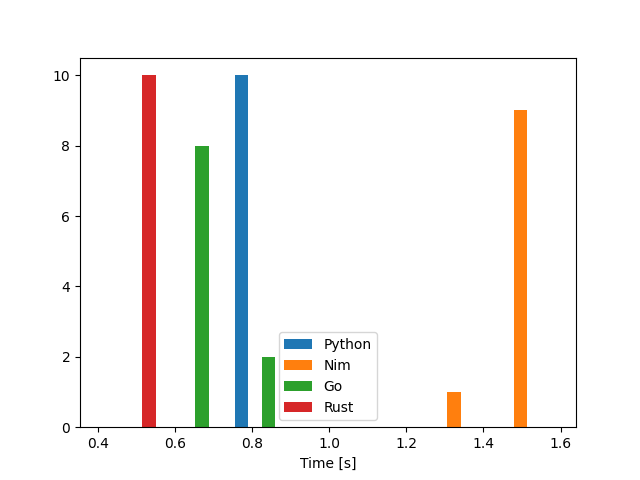

# Anagram

This is a Kata that I came across a few months ago. Though it is not truly a real world problem, it definitely embodies some of my daily challenges.

I have tried to make all the versions as close as possible.

Here is the link to the [original Kata](http://codekata.com/kata/kata06-anagrams/).

## Table of Contents

- [Anagram](#anagram)
  - [Table of Contents](#table-of-contents)
  - [Test bench](#test-bench)
  - [Languages](#languages)
  - [Prerequisites](#prerequisites)
    - [Python](#python)
    - [Nim](#nim)
    - [Go](#go)
    - [Rust](#rust)
  - [Run](#run)
  - [Results](#results)
    - [Machine time](#machine-time)
    - [Development time](#development-time)
    - [Verdict](#verdict)
    - [Closing Note](#closing-note)

## Test bench

| OS                 | Kernel     | CPU                            | Memory |
| ------------------ | ---------- | ------------------------------ | ------ |
| Ubuntu 20.04.4 LTS | 5.10.102.1 | Intel i7-7700HQ (8) @ 2.807GHz | 24GB   |

## Languages

| Language | Version  |
| -------- | -------- |
| Python   | `3.10.5` |
| Nim      | `1.7.1`  |
| Go       | `1.19`   |
| Rust     | `1.63.0` |

## Prerequisites

- Make sure your versions match the [test bench](#test-bench)
- Benchmarking tool: [Hyperfine](https://github.com/sharkdp/hyperfine)
- Plotting done by [this script](https://github.com/sharkdp/hyperfine/blob/master/scripts/plot_histogram.py)

### Python

Check Python version:

```bash
$ python -V
Python 3.10.5
```

---

### Nim

Check and compile Nim version:

```bash
$ nim -V
Nim Compiler Version 1.7.1 [Linux: amd64]
Compiled at 2022-08-12
Copyright (c) 2006-2022 by Andreas Rumpf

git hash: ff25103c9ab9d51821e9e8641955c8d24f7db6b8
```

```bash
nim c -d:release -mm:orc --threads:off -o:ananim ana.nim
```

> with or without threads, the result is the same

---

### Go

Check and compile Go version:

```bash
$ go version
go version go1.19 linux/amd64
```

```bash
go build -o anago ana.go
```

Please `unrar` the `wordlist.rar` before running the benchmark.

```bash
unrar x wordlist.rar
```

### Rust

Check and compile Rust version:

```bash
$ rustc --version
rustc 1.63.0 (4b91a6ea7 2022-08-08)
```

```bash
cargo build -r
```

---

## Run

Drop the current caches:

```bash
sync; echo 3 | sudo tee /proc/sys/vm/drop_caches
```

Run the benchmark:

```bash
hyperfine "python3.10 ana.py" "./ananim" "./anago" "./anarust"
```

## Results

### Machine time

`Go` managed to come out first but oddly enough, `Nim` is the slowest.

| Language |     Mean [ms] | Min [ms] | Max [ms] |    Relative |
| :------- | ------------: | -------: | -------: | ----------: |
| `Rust`   |  450.5 ± 25.8 |    413.3 |    504.9 |        1.00 |
| `Go`     |  799.8 ± 24.9 |    762.9 |    838.2 | 1.78 ± 0.12 |
| `Python` |  920.8 ± 57.2 |    831.2 |   1016.1 | 2.04 ± 0.17 |
| `Nim`    | 1584.6 ± 52.5 |   1516.3 |   1689.0 | 3.52 ± 0.23 |

---



The `JSON` result is also provided [here](anagram.json) in case you would like to replicate the plot.

### Development time

I did not time my work for this project though all the versions got completed in an afternoon. However, I will rate each version from quick to slow (read easy to hard).

1. Python
2. Nim
3. Go
4. Rust

### Verdict

`Python` was the easiest/quickest to write and since the completion time is very close to `Go` and not too far off from `Rust`, it is the clear choice for this specific problem.

### Closing Note

`Go` surprised me once again with the amount of hoops that I had to jump through to solve such a simple problem. Even more than `Rust`.
